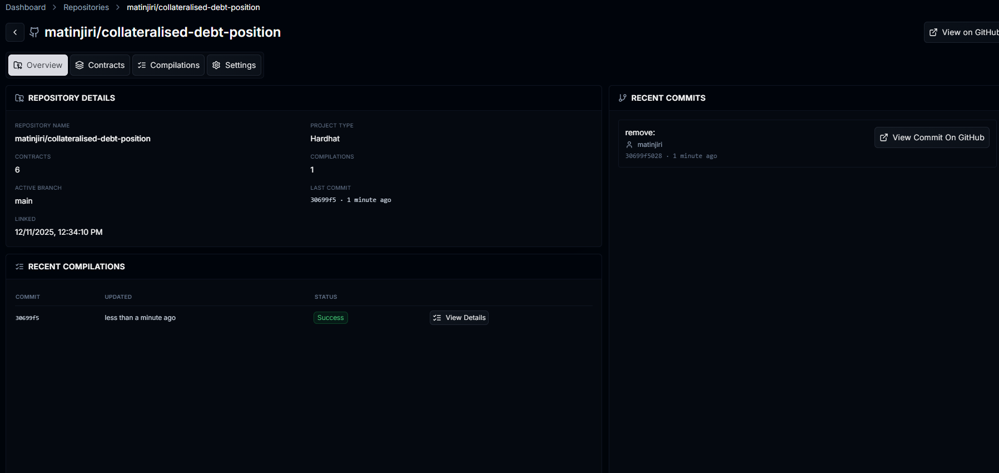

# Contract.dev – Early Builder Hackathon

## Overview

This document describes how to deploy the project to **[Stagenet](https://contract.dev)**, a private testnet environment that replays Ethereum mainnet state. Stagenet allows teams to import contracts directly from GitHub and provides built‑in developer tools(we use WETH faucet and real Chainlink intraction) and analytics for debugging, tracing, and monitoring deployments .

## Project Setup

### 2. Install Dependencies

```bash
npm install
```

### 3. Compile Contracts

Verify that the project compiles successfully before importing it into [Stagenet](https://contract.dev):

```bash
npx hardhat compile
```

Expected result:

* No compilation errors
* Artifacts generated in the `artifacts/` directory

---

## Deploying on Stagenet

### Step 1: Access Stagenet Dashboard

1. Navigate to the **Contract.dev Stagenet** dashboard
2. Sign in using your GitHub account
3. Select **Create New Project** or **Import Project**

---

### Step 2: Import Project from GitHub

1. Choose **Import from GitHub**
2. Select the repository containing your smart contracts
3. Choose the correct branch (e.g. `main` or `develop`)
4. Confirm repository access


---


---

## Detailed Deployment Guide (PDF)

For a step-by-step visual walkthrough of the deployment process, including screenshots and configuration details, refer to the full deployment guide:

📄 **[CDP Deployment Guide (PDF)](https://github.com/matinjiri/collateralised-debt-position/blob/main/CDP%20Deployment.pdf)**

This document complements the instructions above and provides additional clarity on the Stagenet setup and deployment flow.
